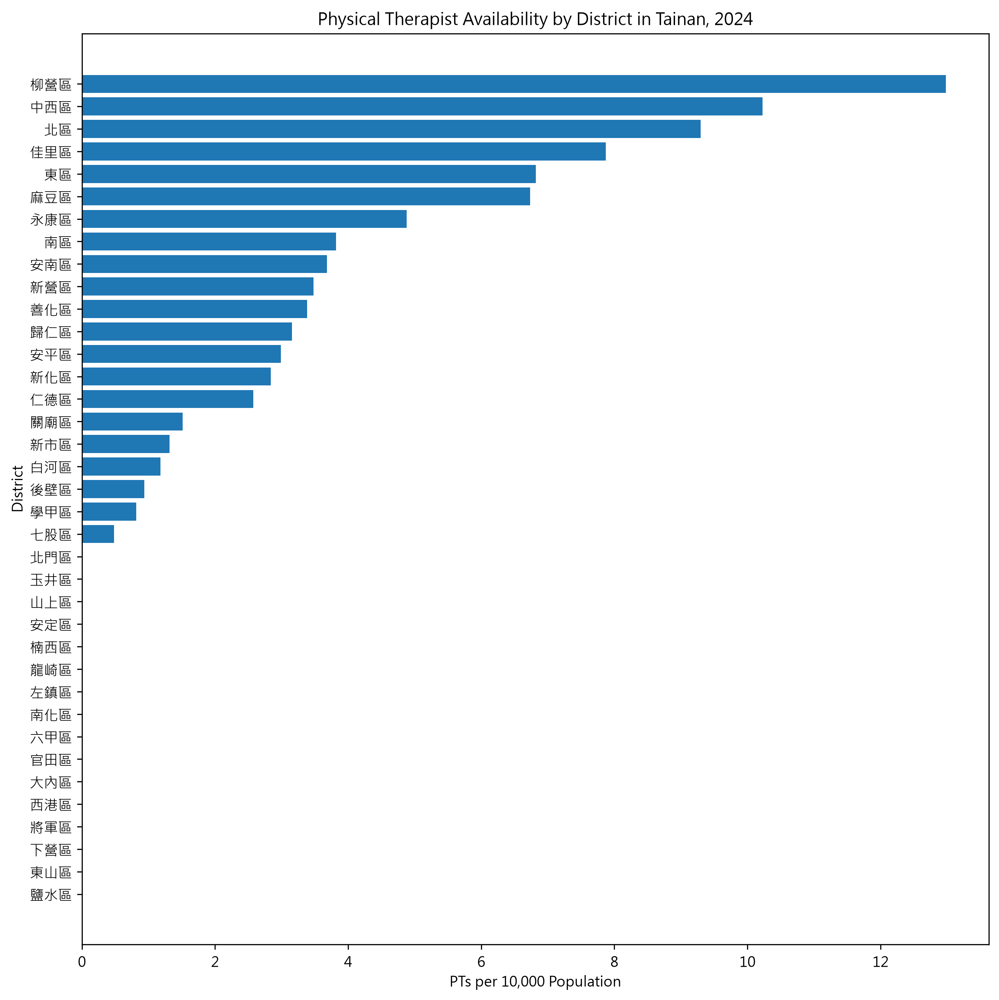
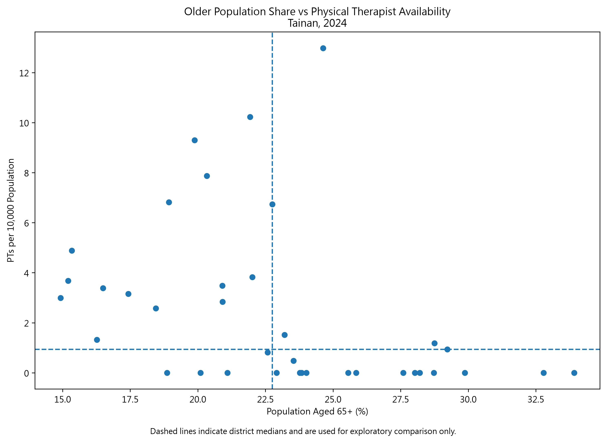
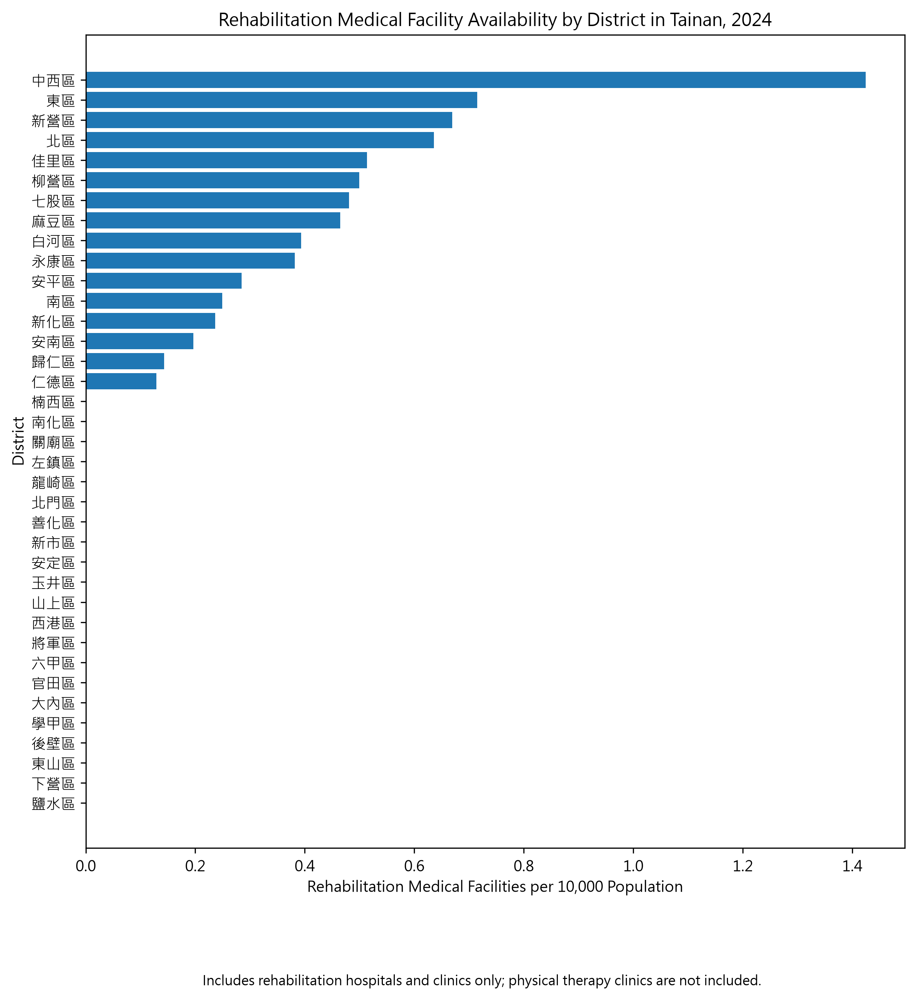

# Rehabilitation Service Accessibility and Resource Gap Analysis
## A Tainan Case Study

This project explores district-level differences in rehabilitation workforce
and medical facility availability across the 37 administrative districts of
Tainan City using 2024 public data.

The project was developed as an independent data analysis project to practice
translating a healthcare service problem into a measurable resource allocation
and accessibility problem.

---

## Background

Rehabilitation services often require repeated and long-term utilization.
Therefore, the geographic distribution of rehabilitation workforce and medical
facilities may affect how easily residents can access services.

With a background in physical therapy, I became interested in whether
rehabilitation-related resources are distributed similarly across different
districts of Tainan City.

Rather than evaluating individual clinical outcomes, this project focuses on
the system-level distribution of rehabilitation resources.

---

## Research Question

**How are rehabilitation-related workforce and medical facilities distributed
across the 37 districts of Tainan City, and where might relative resource gaps exist?**

---

## Data

Reference year: **2024**

Analysis unit: **37 administrative districts of Tainan City**

### Demand-side variables
- Total population
- Population aged 65+
- Percentage of population aged 65+

### Supply-side variables
- Registered physical therapists
- Rehabilitation clinics
- Hospitals with rehabilitation departments

Data were obtained from publicly available government datasets and cleaned at
the district level before integration.

---

## Key Indicators

### Workforce availability

`PTs per 10,000 population`

Used to compare physical therapist availability across districts with different
population sizes.

### Older-population demand proxy

`PTs per 10,000 population aged 65+`

Population aged 65+ is used only as a proxy for potential rehabilitation demand
and does not represent actual rehabilitation utilization.

### Medical facility availability

`Rehabilitation medical facilities per 10,000 population`

Rehabilitation medical facilities in this project are defined as:

- rehabilitation clinics
- hospitals with rehabilitation departments

---

## Data Processing

The analysis pipeline includes:

1. Raw data inspection and schema validation
2. District-level data cleaning
3. Missing-value and duplicate-key checks
4. Administrative district code mapping
5. Cross-dataset merging
6. Population-standardized indicator calculation
7. Exploratory visualization

A master dataset was created by integrating population, workforce, clinic,
and hospital data using district as the common key.

---

## Data Quality Handling

Several data quality issues were identified during processing.

For example, the 2024 population dataset contained malformed age-column labels.
Instead of directly using the affected fields, population aged 65+ was
calculated as:

`Total population - Population aged 0–64`

The result was further validated against the available 65–99 age groups and
the implied population aged 100+.

Hospital data also used a sparse structure in which districts without hospitals
were absent from the original dataset. A complete 37-district reference table
was therefore used before assigning confirmed zero values.

---

## Preliminary Findings

The analysis shows substantial variation in registered physical therapist
availability across districts after adjusting for population size.

In the 2024 official workforce dataset, 16 of the 37 districts had zero
registered physical therapists.

Exploratory comparison of older-population share and PT availability also
suggests that some districts combine relatively high proportions of older
residents with relatively low PT workforce availability.

These observations indicate **potential resource gaps** and should not be
interpreted as proof of unmet rehabilitation demand.

---
## Visualizations

### Physical Therapist Availability



PT workforce was standardized by district population to allow comparison
across districts of different population sizes.

---

### Older Population Share vs PT Availability



Dashed lines represent district medians and are used only for exploratory
comparison. They do not represent official thresholds for resource shortage.

---

### Rehabilitation Medical Facility Availability



Medical facilities include rehabilitation clinics and hospitals with
rehabilitation departments. Physical therapy clinics are not included due to
data availability limitations.


---
## Data Limitations

- **Physical therapy clinics are not included in the facility-level analysis.**
  A consistent 2024 district-level historical dataset could not be confirmed.
  Because physical therapy clinics are an important rehabilitation service
  resource, facility availability may be underestimated in some districts.

- **PT headcount does not equal actual service capacity.**
  Working hours, treatment duration, service models, and patient volume are
  not captured.

- **Population aged 65+ is only a demand proxy.**
  Not every older resident requires rehabilitation services.

- Cross-district travel and actual patient utilization are not included.

Therefore, this project describes district-level resource distribution and
potential gaps rather than measuring actual unmet need.

---

## Dashboard

A Streamlit prototype dashboard was developed to present:

- Key rehabilitation resource indicators
- PT availability by district
- Rehabilitation medical facility availability
- Older-population share versus PT availability
- District-level summary data

Run locally with:

```bash
python -m streamlit run dashboard/app.py